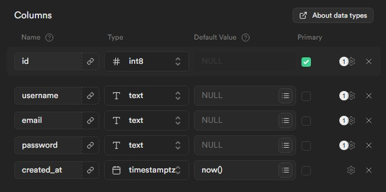
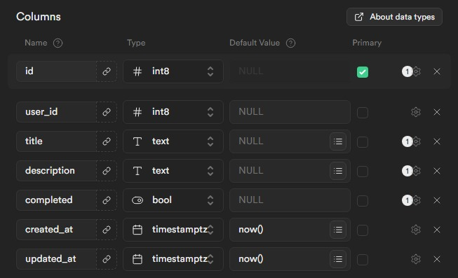

 

  

# Quesk

This repository is created as a learning project that utilizes Next.js for both the frontend and backend development, TailwindCSS to style the web interface, and Supabase as a database that stores user data and tasks.

Visit website: [https://quesk.vercel.app/](https://quesk.vercel.app/)

Also, check out the `mobile app repository`

## Features

- User authentication.
- Update user data.
- Create/update/delete task.
- Mark task as completed.
- Search tasks.
- Available theme: light, dark.
- Multilingual support: English, Indonesia.

## Highlight

- Encoded email and password on `authentication`.
- Utilizes JSON Web Token for `authorization`.
- Encoded old password and new password when trying to `change password`.
- Password is `hashed` before being stored on the database.
- Server wil return `conflict` with 409 status code when attempting to edit record with existing data.
- Server wil return `not found` with 404 status code when attempting to access nonexistent record.
- Server wil return `unauthorized` with 401 status code when attempting to access unauthorized record.

## Technologies Used

- Next.js
- JSON Web Token
- Typescript
- React.js
- Tailwind CSS
- Supabase

## Supabase Setup

- Login or create an account on Supabase.
- Create a new project and database.
- Create tables with these schema:

**Users Table**

**Tasks Table**

- Rename `.env.local.sample` to `.env.local`.
- Copy the Supabase credentials and paste them to environment variables in the `.env.local` file.

## Installation

- Clone the repository.
- Install the dependencies with `npm install`.
- Setup Supabase environment variable.
- Run the application with `npm run dev`.
- Open your browser.
- Visit [http://localhost:3000](http://localhost:3000).
